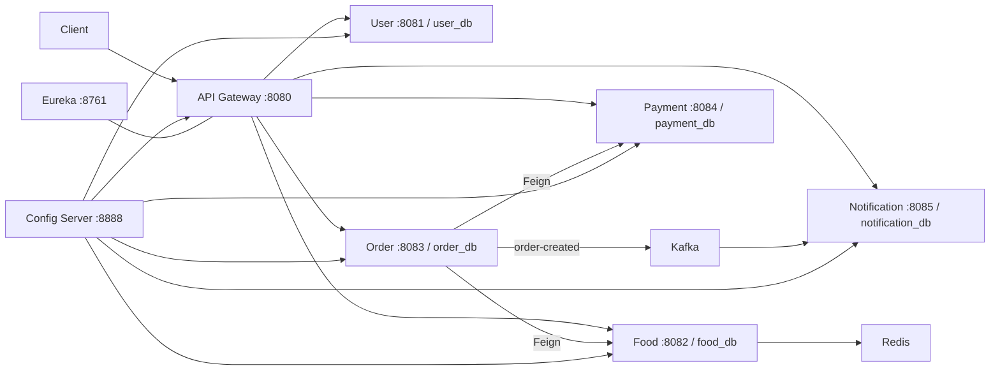
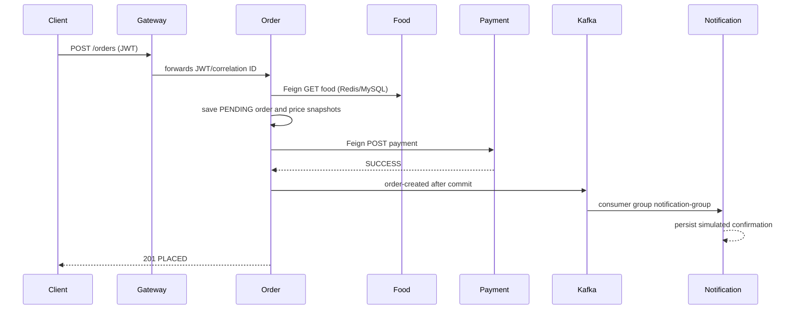

# Architecture

```mermaid
flowchart LR
 Client --> Gateway[API Gateway :8080]
 Gateway --> User[User :8081 / user_db]
 Gateway --> Food[Food :8082 / food_db]
 Gateway --> Order[Order :8083 / order_db]
 Gateway --> Payment[Payment :8084 / payment_db]
 Gateway --> Notification[Notification :8085 / notification_db]
 Order -->|Feign| Food
 Order -->|Feign| Payment
 Food --> Redis
 Order -->|order-created| Kafka
 Kafka --> Notification
 Config[Config Server :8888] --> Gateway & User & Food & Order & Payment & Notification
 Eureka[Eureka :8761] --- Gateway
```

```mermaid
sequenceDiagram
 Client->>Gateway: POST /orders (JWT)
 Gateway->>Order: forwards JWT/correlation ID
 Order->>Food: Feign GET food (Redis/MySQL)
 Order->>Order: save PENDING order and price snapshots
 Order->>Payment: Feign POST payment
 Payment-->>Order: SUCCESS
 Order->>Kafka: order-created after commit
 Kafka->>Notification: consumer group notification-group
 Notification-->>Notification: persist simulated confirmation
 Order-->>Client: 201 PLACED
```
